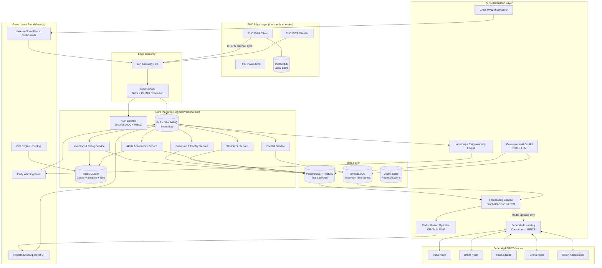

# Smart Health & Supply Chain Resilience
## National-Scale Health Resilience & Supply Chain Platform — System Architecture Design Document

---

## 1. Executive Architectural Overview & System Topology

### 1.1 Architectural Philosophy

The platform is split along a **capture / intelligence / decision** axis, not a technology axis. This matters because the two portals have opposite non-functional profiles:

| Concern | PHC Portal | Governance Portal |
|---|---|---|
| Device class | Low-spec Android, shared kiosks | Desktop, large displays |
| Connectivity | Intermittent, 2G/3G, offline days at a time | Reliable broadband |
| Data direction | Write-heavy, small payloads | Read-heavy, large aggregates |
| Latency tolerance | High (eventual consistency acceptable) | Low (near-real-time dashboards) |
| User skill | Minimal training, task-focused | Analyst / decision-maker |

This split drives the decision to use a **Modular Monolith with domain-isolated modules**, not a full microservices mesh, for the initial 2 phases (justified in §3.1), evolving into extracted services for AI/optimization workloads which have distinct scaling and deployment cadences.

### 1.2 System Topology (Mermaid)



### 1.3 Layer Responsibilities Summary

1. **Edge Layer** — offline-first capture, local validation, local queueing.
2. **Gateway/Sync** — auth, delta-sync, conflict resolution, backpressure.
3. **Core Platform** — domain services, each owning its own schema, communicating via events, not shared tables.
4. **AI/Optimization Layer** — decoupled from transactional path; consumes events and DB snapshots, never blocks a PHC write.
5. **Data Layer** — PostgreSQL/PostGIS for entities and geo, TimescaleDB for high-cardinality time-series, object storage for generated reports.
6. **Governance Portal** — read-optimized, GraphQL-backed, drill-down UI.
7. **BRICS Federated Layer** — exchanges model gradients/weights only, never raw records.

---

## 2. Frontend Architecture & Data-Binding Strategy

### 2.1 PHC Portal (Offline-First PWA)

**Stack**: React + Vite, TypeScript, Service Worker (Workbox), IndexedDB (via Dexie.js) as the local source of truth, React Query for server-state reconciliation once online.

**State model — three tiers:**

- **UI state** (React local state / Zustand): form drafts, navigation.
- **Local persisted state** (IndexedDB): the facility's operational record — inventory, beds, staff, footfall, pending mutations queue.
- **Server state** (synced via React Query, reconciled against IndexedDB): last-known-good server snapshot.

Every write (e.g., a billing checkout) is committed to IndexedDB **immediately and optimistically**, tagged with a client-generated UUID, a Lamport-style monotonic `local_seq`, and `device_id`. The UI never waits on network.

**Offline mutation queue schema (IndexedDB):**

```
mutation_queue {
  id: uuid (PK)
  entity_type: string        // 'dispensed_items', 'footfall', etc.
  payload: json
  device_id: string
  local_seq: integer
  created_at: timestamp
  sync_status: enum('pending','in_flight','synced','conflict','failed')
  retry_count: integer
  last_error: string | null
}
```

### 2.2 Delta-Sync & Conflict Resolution

**Sync protocol:**

1. On connectivity, client sends `POST /sync/push` with all `pending` mutations batched (capped at ~200 KB per batch to survive flaky links), each with `device_id`, `local_seq`, `entity_type`, `payload`, and a `client_timestamp`.
2. Server assigns a global `server_seq` per accepted mutation and returns an ack list.
3. Client then requests `GET /sync/pull?since=<last_server_seq>` to receive authoritative deltas (e.g., redistribution approvals, threshold config changes, alerts) it doesn't yet have.
4. Client applies pulled deltas to IndexedDB and advances its local watermark.

**Conflict classes and resolution strategy:**

| Conflict type | Example | Resolution |
|---|---|---|
| Append-only events | Dispensing transaction, footfall entry | No conflict possible — each is a new row with a UUID; last-write-wins is irrelevant since nothing is overwritten. |
| Mutable counters | "Total beds = 25" edited on two devices offline | Server applies **operational transform**: store as a sequence of delta operations (`+1`, `-1`) rather than absolute values where possible; absolute-value edits use last-write-wins by `server-authoritative timestamp`, with the losing edit surfaced to the PHC admin as a flagged discrepancy. |
| Stock-level races | Two dispensing checkouts against the same batch while offline on two devices | Server is the **only** place stock is authoritative. Client-side deduction is *optimistic UI only*. On sync, server re-validates FEFO batch availability; if the batch is oversold, the second transaction is queued into a `sync_status='conflict'` state and routed to a reconciliation queue with an alert to the PHC. |
| Duplicate submission | Retry after a dropped ack | Idempotency key = mutation UUID; server upserts, never double-applies. |

**Retry/backoff**: exponential backoff (1s → 2s → 4s … capped at 5 min) with jitter; queue persists across app restarts; a background Service Worker sync event retries opportunistically when the browser signals connectivity.

### 2.3 Governance Portal (Next.js)

- **Data fetching**: GraphQL (Apollo Client) for the dashboard's nested, drill-down queries (national → state → district → PHC) to avoid REST over-fetching; REST/OpenAPI for transactional actions (approve/reject redistribution).
- **Real-time**: SSE for the alert feed and KPI tiles (simpler ops than WebSockets, sufficient for server→client push); WebSockets reserved for the What-If Simulator's interactive session (bidirectional, low-latency parameter tweaking).
- **GIS**: Deck.gl + MapLibre for heatmap and drill-down layers, backed by PostGIS spatial queries cached in Redis (`GEOADD`/`GEOSEARCH`) for sub-second map interaction at national scale.
- **State**: server state via React Query/Apollo cache; UI/session state via Zustand; the What-If Simulator keeps scenario state client-side until "run," then posts to the simulation service.

---

## 3. Backend Microservices & API Contract Specification

### 3.1 Service Pattern Justification

**Recommendation: Modular Monolith for Phases 1–2, selective extraction from Phase 3 onward.**

Reasoning:
- Thousands of PHCs writing small, frequent transactions is a **throughput** problem better solved by good indexing and a well-tuned connection pool than by network-hop microservices.
- A monolith with strict module boundaries (separate schemas per domain, no cross-module SQL joins, communication only via an internal event bus) gives 90% of microservices' maintainability without the operational tax of distributed tracing, service mesh, and inter-service auth for a team building an MVP-to-national-scale product incrementally.
- **Extraction candidates** once load profiles diverge: the **Forecasting/Optimization engine** (CPU/GPU-bound, different scaling curve, Python-native for ML libs vs. the core services which can be Node/Go/Java) and the **Federated Learning Coordinator** (must be network-isolated for BRICS cross-border compliance). These are natural seams because they are already decoupled by the event bus and read replicas — no shared transactional state.

### 3.2 API Surfaces

- **REST/OpenAPI**: all PHC-facing writes (inventory, billing, footfall, requests) — simple, cacheable, easy to retry/idempotency-key.
- **GraphQL**: governance dashboard reads — arbitrary drill-down depth without endpoint explosion.
- **SSE**: alert stream, KPI tick updates.
- **WebSocket**: crisis simulator interactive sessions, governance copilot streaming responses.

### 3.3 Key Endpoint Contracts

#### 3.3.1 FEFO Checkout (Billing → Stock Deduction)

```
POST /api/v1/phc/{phcId}/billing/checkout
Headers: Idempotency-Key: <client-uuid>
```
Request:
```json
{
  "client_txn_id": "uuid",
  "patient_ref": "walk_in | patient_id",
  "items": [
    { "medicine_id": "uuid", "quantity": 20 }
  ],
  "dispensed_by_staff_id": "uuid",
  "client_timestamp": "2026-09-12T10:15:00Z"
}
```
Server-side flow:
1. Idempotency check on `client_txn_id`.
2. For each line item, lock candidate batches (`SELECT ... FOR UPDATE SKIP LOCKED`) ordered by `expiry_date ASC` (FEFO).
3. Deduct across one or more batches until quantity satisfied; if insufficient total stock, reject the line with `409 INSUFFICIENT_STOCK` and the max fulfillable quantity.
4. Insert `billing_transactions` + `dispensed_items` (one row per batch consumed).
5. Recompute `inventory_batches.remaining_qty`; if below `minimum_threshold`, emit `stock.threshold_breached` event.
6. Emit `billing.transaction_completed` event (consumed by the Micro-Consumption Velocity Analyzer).

Response:
```json
{
  "bill_id": "uuid",
  "status": "completed",
  "lines": [
    { "medicine_id": "uuid", "batches_consumed": [
        { "batch_id": "uuid", "expiry_date": "2026-11-01", "qty": 20 }
      ],
      "remaining_stock": 8480,
      "threshold_status": "normal"
    }
  ]
}
```

#### 3.3.2 Resource/Supply Request Creation

```
POST /api/v1/phc/{phcId}/requests
```
```json
{
  "request_type": "medicine | oxygen | bed | staff | equipment",
  "item_ref": "medicine_id or equipment_id (nullable for staff)",
  "quantity": 3000,
  "priority": "routine | urgent | critical",
  "reason": "auto_velocity | manual | threshold_breach",
  "source": "manual | auto_draft"
}
```
Response includes `request_id`, `status: 'pending'`, and routes to the District Admin queue via the `resource_requests` table + `request.created` event.

#### 3.3.3 Redistribution Approval Workflow

```
GET  /api/v1/governance/redistribution/recommendations?district={id}
POST /api/v1/governance/redistribution/{recommendationId}/decision
```
```json
{
  "decision": "approve | reject | modify",
  "modified_quantity": 2500,
  "decided_by": "user_id",
  "notes": "string"
}
```
On `approve`, server creates a `redistribution_transfers` row (`status='dispatched'`), emits `redistribution.approved`, which the Supply Chain Visibility module picks up to track physical movement (`in_transit → delivered`).

#### 3.3.4 Real-Time Feeds

```
GET /api/v1/governance/alerts/stream   (SSE)
GET /api/v1/governance/kpi/stream      (SSE)
WS  /api/v1/governance/simulator/session
```

---

## 4. Data Model Architecture

### 4.1 Core Transactional Schema (PostgreSQL + PostGIS)

```sql
-- Facilities
CREATE TABLE phc_facilities (
    id UUID PRIMARY KEY DEFAULT gen_random_uuid(),
    name VARCHAR(255) NOT NULL,
    district_id UUID NOT NULL,
    state_id UUID NOT NULL,
    location GEOGRAPHY(POINT, 4326) NOT NULL,
    total_beds INT NOT NULL DEFAULT 0,
    emergency_beds INT NOT NULL DEFAULT 0,
    isolation_beds INT NOT NULL DEFAULT 0,
    occupied_beds INT NOT NULL DEFAULT 0,
    oxygen_cylinders INT NOT NULL DEFAULT 0,
    oxygen_concentrators INT NOT NULL DEFAULT 0,
    status VARCHAR(20) NOT NULL DEFAULT 'active',
    created_at TIMESTAMPTZ NOT NULL DEFAULT now(),
    updated_at TIMESTAMPTZ NOT NULL DEFAULT now()
);
CREATE INDEX idx_phc_location ON phc_facilities USING GIST (location);
CREATE INDEX idx_phc_district ON phc_facilities (district_id);

-- Equipment
CREATE TABLE equipment (
    id UUID PRIMARY KEY DEFAULT gen_random_uuid(),
    phc_id UUID NOT NULL REFERENCES phc_facilities(id),
    equipment_type VARCHAR(100) NOT NULL,
    quantity INT NOT NULL DEFAULT 1,
    working_qty INT NOT NULL DEFAULT 1,
    maintenance_status VARCHAR(20) NOT NULL DEFAULT 'operational',
    last_serviced_at DATE,
    created_at TIMESTAMPTZ NOT NULL DEFAULT now()
);
CREATE INDEX idx_equipment_phc ON equipment (phc_id);

-- Medicine master + batches (FEFO unit)
CREATE TABLE medicines (
    id UUID PRIMARY KEY DEFAULT gen_random_uuid(),
    name VARCHAR(255) NOT NULL,
    category VARCHAR(100),
    unit VARCHAR(20) NOT NULL DEFAULT 'unit'
);

CREATE TABLE inventory_batches (
    id UUID PRIMARY KEY DEFAULT gen_random_uuid(),
    phc_id UUID NOT NULL REFERENCES phc_facilities(id),
    medicine_id UUID NOT NULL REFERENCES medicines(id),
    batch_no VARCHAR(100) NOT NULL,
    received_qty INT NOT NULL,
    remaining_qty INT NOT NULL,
    minimum_threshold INT NOT NULL DEFAULT 0,
    expiry_date DATE NOT NULL,
    received_at TIMESTAMPTZ NOT NULL DEFAULT now(),
    UNIQUE (phc_id, medicine_id, batch_no)
);
-- FEFO index: fast "earliest expiry with stock" lookup
CREATE INDEX idx_batches_fefo ON inventory_batches (phc_id, medicine_id, expiry_date)
    WHERE remaining_qty > 0;

CREATE TABLE billing_transactions (
    id UUID PRIMARY KEY DEFAULT gen_random_uuid(),
    phc_id UUID NOT NULL REFERENCES phc_facilities(id),
    client_txn_id UUID NOT NULL UNIQUE,   -- idempotency key
    patient_ref VARCHAR(100),
    dispensed_by_staff_id UUID,
    total_amount NUMERIC(12,2),
    client_timestamp TIMESTAMPTZ NOT NULL,
    server_timestamp TIMESTAMPTZ NOT NULL DEFAULT now(),
    status VARCHAR(20) NOT NULL DEFAULT 'completed'
);

CREATE TABLE dispensed_items (
    id UUID PRIMARY KEY DEFAULT gen_random_uuid(),
    billing_transaction_id UUID NOT NULL REFERENCES billing_transactions(id),
    batch_id UUID NOT NULL REFERENCES inventory_batches(id),
    medicine_id UUID NOT NULL REFERENCES medicines(id),
    quantity INT NOT NULL,
    unit_price NUMERIC(10,2)
);
CREATE INDEX idx_dispensed_txn ON dispensed_items (billing_transaction_id);
CREATE INDEX idx_dispensed_medicine_time ON dispensed_items (medicine_id) INCLUDE (quantity);

-- Staff
CREATE TABLE staff_registry (
    id UUID PRIMARY KEY DEFAULT gen_random_uuid(),
    phc_id UUID NOT NULL REFERENCES phc_facilities(id),
    role VARCHAR(50) NOT NULL,  -- doctor, nurse, pharmacist, technician, other
    name VARCHAR(255) NOT NULL,
    active BOOLEAN NOT NULL DEFAULT true
);

CREATE TABLE staff_attendance (
    id UUID PRIMARY KEY DEFAULT gen_random_uuid(),
    staff_id UUID NOT NULL REFERENCES staff_registry(id),
    attendance_date DATE NOT NULL,
    status VARCHAR(20) NOT NULL, -- present/absent/leave
    UNIQUE (staff_id, attendance_date)
);

-- Requests & Alerts
CREATE TABLE resource_requests (
    id UUID PRIMARY KEY DEFAULT gen_random_uuid(),
    phc_id UUID NOT NULL REFERENCES phc_facilities(id),
    request_type VARCHAR(20) NOT NULL,
    item_ref UUID,
    quantity INT,
    priority VARCHAR(20) NOT NULL DEFAULT 'routine',
    reason VARCHAR(30),
    status VARCHAR(20) NOT NULL DEFAULT 'pending', -- pending/approved/dispatched/delivered/rejected
    created_at TIMESTAMPTZ NOT NULL DEFAULT now(),
    decided_at TIMESTAMPTZ,
    decided_by UUID
);
CREATE INDEX idx_requests_status ON resource_requests (status, priority);

CREATE TABLE redistribution_transfers (
    id UUID PRIMARY KEY DEFAULT gen_random_uuid(),
    source_phc_id UUID NOT NULL REFERENCES phc_facilities(id),
    dest_phc_id UUID NOT NULL REFERENCES phc_facilities(id),
    item_ref UUID NOT NULL,
    quantity INT NOT NULL,
    recommended_by VARCHAR(20) NOT NULL DEFAULT 'ai', -- ai/manual
    status VARCHAR(20) NOT NULL DEFAULT 'recommended', -- recommended/approved/in_transit/delivered/rejected
    decided_by UUID,
    created_at TIMESTAMPTZ NOT NULL DEFAULT now()
);

CREATE TABLE alerts (
    id UUID PRIMARY KEY DEFAULT gen_random_uuid(),
    phc_id UUID REFERENCES phc_facilities(id),
    alert_type VARCHAR(50) NOT NULL, -- stockout, bed_shortage, staff_shortage, outbreak, oxygen
    severity VARCHAR(20) NOT NULL,
    payload JSONB,
    status VARCHAR(20) NOT NULL DEFAULT 'open',
    created_at TIMESTAMPTZ NOT NULL DEFAULT now(),
    resolved_at TIMESTAMPTZ
);
CREATE INDEX idx_alerts_open ON alerts (status, severity) WHERE status = 'open';
```

### 4.2 Time-Series Schema (TimescaleDB)

```sql
CREATE TABLE patient_footfall (
    time TIMESTAMPTZ NOT NULL,
    phc_id UUID NOT NULL,
    category VARCHAR(50) NOT NULL, -- opd/emergency/admission/referral, disease category
    count INT NOT NULL
);
SELECT create_hypertable('patient_footfall', 'time');
CREATE INDEX idx_footfall_phc_time ON patient_footfall (phc_id, time DESC);

CREATE TABLE consumption_velocity (
    time TIMESTAMPTZ NOT NULL,
    phc_id UUID NOT NULL,
    medicine_id UUID NOT NULL,
    qty_dispensed INT NOT NULL
);
SELECT create_hypertable('consumption_velocity', 'time');

-- Continuous aggregate for the Micro-Consumption Velocity Analyzer
CREATE MATERIALIZED VIEW consumption_daily
WITH (timescaledb.continuous) AS
SELECT phc_id, medicine_id, time_bucket('1 day', time) AS day,
       SUM(qty_dispensed) AS total_qty
FROM consumption_velocity
GROUP BY phc_id, medicine_id, day;
```

Rationale: `patient_footfall` and `consumption_velocity` are high-write, append-only, time-ordered — a textbook Timescale hypertable use case, with continuous aggregates powering both the PHC's own trend view and the forecasting pipeline without re-scanning raw rows.

---

## 5. AI Pipeline & Optimization Engine Architecture

### 5.1 FEFO Stock Deduction Logic

Not itself an ML task — a **transactional allocation algorithm** that must be correct and race-free:

```
function dispense(phc_id, medicine_id, qty_requested):
    batches = SELECT * FROM inventory_batches
              WHERE phc_id=phc_id AND medicine_id=medicine_id AND remaining_qty > 0
              ORDER BY expiry_date ASC
              FOR UPDATE SKIP LOCKED

    remaining = qty_requested
    allocations = []
    for batch in batches:
        if remaining == 0: break
        take = min(batch.remaining_qty, remaining)
        batch.remaining_qty -= take
        remaining -= take
        allocations.append((batch.id, take))

    if remaining > 0:
        rollback; return INSUFFICIENT_STOCK(max_available = qty_requested - remaining)

    commit(allocations)
    if any(batch.remaining_qty < batch.minimum_threshold for batch in touched_batches):
        emit stock.threshold_breached
    return allocations
```

`SELECT ... FOR UPDATE SKIP LOCKED` avoids lock contention across concurrent checkouts at the same PHC while still guaranteeing no batch is oversold.

### 5.2 Demand Forecasting

- **Per-medicine, per-PHC daily consumption forecast**: Prophet as the default (handles seasonality, holidays, missing data gracefully — appropriate given sparse/noisy PHC data) with **XGBoost** as a challenger model using lag features (7/14/30-day rolling consumption, footfall, disease-category counts, season) for PHCs with enough history; the pipeline picks whichever backtests better per-series (simple champion/challenger, not a fixed choice).
- **LSTM** reserved for national/state aggregate series (bed demand, oxygen demand) where longer sequence dependencies and multivariate inputs (footfall + weather + outbreak signals) justify the extra complexity and available training volume.
- **Retraining cadence**: nightly batch job per PHC-medicine pair with sufficient new data; incremental online update deferred — batch retraining is simpler to audit and roll back, which matters for a governance-facing system.

### 5.3 Early-Warning / Anomaly Detection

Real-time layer consuming the event bus directly (not waiting for batch forecasts):

- **Threshold-based** (fires immediately): stock below minimum, bed occupancy > configurable %, oxygen below critical level.
- **Statistical anomaly** (rolling z-score / EWMA on `consumption_daily` and `patient_footfall`): flags sudden departures from a PHC's own baseline — e.g., footfall 3σ above its trailing 14-day mean → outbreak early-warning signal, cross-checked against neighboring PHCs' signals before escalating to reduce false positives from a single miscount.

### 5.4 Cross-District Redistribution Optimization (MILP)

Formulated as a **transportation problem with urgency weighting**, solved with OR-Tools' CP-SAT or a MILP solver (PuLP + CBC):

**Decision variables**: `x[i][j]` = quantity of a given item moved from surplus node *i* to deficit node *j*.

**Objective**: minimize `Σ (distance[i][j] * x[i][j]) − λ * Σ (urgency[j] * fulfilled[j])` — i.e., minimize transport cost while heavily rewarding fulfillment of urgent deficits (λ tuned so urgency dominates cost for `critical` priority).

**Constraints**:
- `Σ_j x[i][j] ≤ surplus[i]` (can't ship more than a source holds beyond its own buffer).
- `Σ_i x[i][j] ≥ min(deficit[j], available_supply)`.
- Batch-expiry constraint: a batch with `expiry_date − now < transit_time` is excluded as a source (won't arrive usable).
- Max transit distance / time per priority tier (critical requests only source from within N hours' transit).

**Output**: ranked list of recommended transfers surfaced to the Governance Portal's approval workflow (§3.3.3) — the optimizer recommends, a human approves, consistent with the product's "AI recommends, officer decides" design principle.

### 5.5 Crisis What-If Simulator

Deterministic scenario engine by default (fast, explainable — appropriate for a decision-support tool where officials need to trust the number), with Monte Carlo as an option for stochastic scenarios (e.g., "outbreak in a random cluster of PHCs"):

```
input: scenario { footfall_delta%, supply_delta%, affected_districts[], duration_days }
1. Apply deltas to the current forecast baseline per affected PHC.
2. Re-run the demand forecast with adjusted inputs (footfall multiplier feeds directly
   into the consumption/bed-demand model as a covariate).
3. Re-run the redistribution optimizer against the adjusted deficit/surplus map.
4. Return: { additional_beds_needed, additional_oxygen_needed, additional_medicine_by_type,
             additional_staff_needed, most_affected_districts[] }
```

For stochastic scenarios, steps 1–3 run N times with sampled variation and the engine returns percentile bands (P50/P90) rather than a single point estimate.

### 5.6 Governance AI Copilot (RAG)

- **Retrieval**: a scoped, role-filtered retriever over (a) structured DB summaries materialized as text snippets (e.g., "District X: 12 PHCs, 3 critical, medicine stock-out risk in 4 days") refreshed periodically, and (b) alert/recommendation records with their generating rationale.
- **Generation**: LLM answers strictly from retrieved context, with role-based row-level filtering applied *before* retrieval so a State Admin can never retrieve another state's raw data.
- **Explainability mode**: for "why was this alert raised" / "why this redistribution," the copilot is given the actual feature values and optimizer constraints that fired, and is prompted to explain them rather than free-generate — grounding every claim in a retrieved record. This is a natural-language templating problem more than an open-ended generation problem, which keeps hallucination risk low.

### 5.7 BRICS Federated Learning

- **Pattern**: Federated Averaging (FedAvg) via Flower, one client per participating nation, each training locally on its own PHC data.
- **What crosses the border**: only model weight updates (or gradients), never raw records — enforced architecturally (the federated client process has no network egress path for the raw DB, only for the serialized model artifact).
- **Privacy**: differential privacy noise added to gradients before transmission (DP-SGD), plus secure aggregation (the coordinator only ever sees the *sum* of client updates, not individual contributions) to prevent reconstruction of any single nation's data from its update.
- **Scope discipline**: per the source brief, this is explicitly a **Phase 5** capability — the core PHC→AI→governance→action loop should be proven on a single-nation dataset first; federated learning is architected for but not built until that loop is validated.

---

## 6. Security, Governance & Audit Logging Framework

### 6.1 Authentication & Authorization

- **AuthN**: OAuth2/OIDC (e.g., Keycloak or Auth0-compatible), JWT access tokens (short-lived, ~15 min) + refresh tokens; PHC devices additionally bound to a **device certificate** so a stolen credential alone isn't sufficient for write access from an unrecognized device.
- **AuthZ (RBAC)**:

| Role | Scope | Representative permissions |
|---|---|---|
| National Admin | All states | Full read, national redistribution approval, crisis mode activation |
| State Admin | Own state | State read, cross-district approval within state |
| District Admin | Own district | District read/write, cross-PHC redistribution within district |
| PHC User | Own PHC only | Read/write own facility data, submit requests/emergencies |

Enforced at the query layer via row-level security policies keyed to the JWT's `district_id`/`state_id` claims, **not** solely at the API-handler level, so a bug in one endpoint can't leak cross-tenant data.

### 6.2 Data Security

- **Encryption at rest**: AES-256 on PostgreSQL/Timescale volumes and object storage; column-level encryption for any direct patient identifiers.
- **Encryption in transit**: TLS 1.3 everywhere, including PHC-device-to-gateway sync traffic.
- **Anonymization/pseudonymization**: `patient_ref` stores a facility-local pseudonymous identifier by default; footfall and disease-category analytics are aggregate-only above the PHC level — no patient-identifiable data is ever transmitted to governance/national dashboards or to the forecasting pipeline.
- **Multi-tenancy isolation**: logical isolation via RLS + district/state scoping (not physical per-tenant databases, since the whole value proposition is cross-district visibility and optimization — isolation is about *authorization*, not data segregation).

### 6.3 Audit Logging

- Every write to `billing_transactions`, `resource_requests`, `redistribution_transfers`, and every RBAC-relevant read of cross-tenant data is written to an **append-only audit log** (separate table/store, write-only role for application services, no update/delete grants at the DB level).
- Audit entries capture: actor, role, action, entity, before/after diff (for mutable fields), timestamp, source IP/device.
- Redistribution approvals and crisis-mode activations are logged with the AI recommendation payload attached, so every governance decision remains traceable back to the data and model output that informed it — this is the backbone of the copilot's "explain why" capability and of any future compliance audit.

---

## 7. Row-Level Security (RLS) Policy Framework

### 7.1 Tenancy Model & Claims

Isolation is enforced by PostgreSQL RLS, not by application-layer filtering alone, so a bug in a handler can never leak cross-tenant rows. Every authenticated request carries a JWT with claims that are mapped into **session-local Postgres settings** at the start of each transaction (via a lightweight middleware, before any query runs):

```sql
-- Set once per request by the connection-pooling middleware (e.g. pgBouncer session
-- or an app-level `SET LOCAL` inside the transaction), never trusted from client input:
SET LOCAL app.current_role       = 'district_admin';   -- national_admin | state_admin | district_admin | phc_user
SET LOCAL app.current_phc_id     = '3f2a...';           -- only set for phc_user
SET LOCAL app.current_district_id = '9c1b...';          -- set for district_admin and below
SET LOCAL app.current_state_id   = '77ab...';           -- set for state_admin and below
```

These are read inside policies via `current_setting('app.<key>', true)` (the `true` suppresses errors when a setting is unset, e.g. a National Admin has no `district_id`).

A small helper function keeps policies readable and avoids repeating `current_setting` boilerplate in every policy:

```sql
CREATE OR REPLACE FUNCTION app_current_role() RETURNS text AS $$
    SELECT current_setting('app.current_role', true)
$$ LANGUAGE sql STABLE;

CREATE OR REPLACE FUNCTION app_current_phc_id() RETURNS uuid AS $$
    SELECT NULLIF(current_setting('app.current_phc_id', true), '')::uuid
$$ LANGUAGE sql STABLE;

CREATE OR REPLACE FUNCTION app_current_district_id() RETURNS uuid AS $$
    SELECT NULLIF(current_setting('app.current_district_id', true), '')::uuid
$$ LANGUAGE sql STABLE;

CREATE OR REPLACE FUNCTION app_current_state_id() RETURNS uuid AS $$
    SELECT NULLIF(current_setting('app.current_state_id', true), '')::uuid
$$ LANGUAGE sql STABLE;
```

**Scope rule, applied consistently across every policy below:**

| Role | Visible rows |
|---|---|
| `national_admin` | All rows |
| `state_admin` | Rows whose facility's `state_id` matches |
| `district_admin` | Rows whose facility's `district_id` matches |
| `phc_user` | Rows whose facility's `phc_id` matches, own facility only |

### 7.2 `phc_facilities`

```sql
ALTER TABLE phc_facilities ENABLE ROW LEVEL SECURITY;
ALTER TABLE phc_facilities FORCE ROW LEVEL SECURITY;  -- applies even to table owner

CREATE POLICY phc_facilities_select ON phc_facilities
    FOR SELECT
    USING (
        app_current_role() = 'national_admin'
        OR (app_current_role() = 'state_admin'   AND state_id    = app_current_state_id())
        OR (app_current_role() = 'district_admin' AND district_id = app_current_district_id())
        OR (app_current_role() = 'phc_user'        AND id          = app_current_phc_id())
    );

-- PHC users may update only their own facility's operational fields (beds, oxygen, status);
-- district/state boundary edits (renaming, reassigning districts) are reserved for admins.
CREATE POLICY phc_facilities_update_self ON phc_facilities
    FOR UPDATE
    USING (
        app_current_role() IN ('national_admin','state_admin','district_admin')
        OR (app_current_role() = 'phc_user' AND id = app_current_phc_id())
    )
    WITH CHECK (
        app_current_role() IN ('national_admin','state_admin','district_admin')
        OR (app_current_role() = 'phc_user' AND id = app_current_phc_id())
    );

-- Only district admins and above may create/decommission a facility.
CREATE POLICY phc_facilities_insert ON phc_facilities
    FOR INSERT
    WITH CHECK (app_current_role() IN ('national_admin','state_admin','district_admin'));
```

### 7.3 `inventory_batches`

`inventory_batches` has no `district_id`/`state_id` column of its own — it's scoped through its `phc_id` foreign key, so its policy joins back to `phc_facilities`. This join pattern repeats for every facility-scoped table (`equipment`, `billing_transactions`, `dispensed_items`, `staff_registry`, `staff_attendance`, `resource_requests`, `alerts`):

```sql
ALTER TABLE inventory_batches ENABLE ROW LEVEL SECURITY;
ALTER TABLE inventory_batches FORCE ROW LEVEL SECURITY;

CREATE POLICY inventory_batches_select ON inventory_batches
    FOR SELECT
    USING (
        app_current_role() = 'national_admin'
        OR EXISTS (
            SELECT 1 FROM phc_facilities f
            WHERE f.id = inventory_batches.phc_id
              AND (
                (app_current_role() = 'state_admin'    AND f.state_id    = app_current_state_id())
                OR (app_current_role() = 'district_admin' AND f.district_id = app_current_district_id())
                OR (app_current_role() = 'phc_user'        AND f.id          = app_current_phc_id())
              )
        )
    );

-- Stock mutation (dispensing, replenishment) is a PHC-local operation only;
-- district/state/national roles are read-only on batch-level stock.
CREATE POLICY inventory_batches_write ON inventory_batches
    FOR UPDATE
    USING (app_current_role() = 'phc_user' AND phc_id = app_current_phc_id())
    WITH CHECK (app_current_role() = 'phc_user' AND phc_id = app_current_phc_id());

CREATE POLICY inventory_batches_insert ON inventory_batches
    FOR INSERT
    WITH CHECK (app_current_role() = 'phc_user' AND phc_id = app_current_phc_id());
```

To keep the FEFO join fast under RLS (the planner must evaluate the `EXISTS` subquery per row), the existing `idx_batches_fefo` index is retained, and `phc_facilities.id` (PK) plus `phc_facilities(district_id)`/`(state_id)` indexes make the correlated subquery a fast index lookup rather than a scan.

### 7.4 `resource_requests`

Requests need an additional dimension beyond simple visibility: **who may act on them** (approve/reject) versus **who may only view** them. Split into a visibility policy and a decision policy:

```sql
ALTER TABLE resource_requests ENABLE ROW LEVEL SECURITY;
ALTER TABLE resource_requests FORCE ROW LEVEL SECURITY;

CREATE POLICY resource_requests_select ON resource_requests
    FOR SELECT
    USING (
        app_current_role() = 'national_admin'
        OR EXISTS (
            SELECT 1 FROM phc_facilities f
            WHERE f.id = resource_requests.phc_id
              AND (
                (app_current_role() = 'state_admin'    AND f.state_id    = app_current_state_id())
                OR (app_current_role() = 'district_admin' AND f.district_id = app_current_district_id())
                OR (app_current_role() = 'phc_user'        AND f.id          = app_current_phc_id())
              )
        )
    );

-- Creation: a PHC user may only file requests on behalf of their own facility.
CREATE POLICY resource_requests_insert ON resource_requests
    FOR INSERT
    WITH CHECK (
        app_current_role() = 'phc_user' AND phc_id = app_current_phc_id()
    );

-- Decisioning (approve/reject/dispatch): district admin and above only, and only
-- within their own jurisdiction -- a district admin cannot approve another district's request.
CREATE POLICY resource_requests_decide ON resource_requests
    FOR UPDATE
    USING (
        app_current_role() = 'national_admin'
        OR EXISTS (
            SELECT 1 FROM phc_facilities f
            WHERE f.id = resource_requests.phc_id
              AND (
                (app_current_role() = 'state_admin'    AND f.state_id    = app_current_state_id())
                OR (app_current_role() = 'district_admin' AND f.district_id = app_current_district_id())
              )
        )
    )
    WITH CHECK (true);  -- re-checked by the USING clause above on every row touched
```

### 7.5 Cross-Cutting Notes

- **`FORCE ROW LEVEL SECURITY`** is applied on every tenant-scoped table so the policies also bind the table owner/migration role in normal application connections; only a dedicated, separately-audited superuser/migration role bypasses RLS, and that role is never used by application services at runtime.
- **`alerts`** and **`redistribution_transfers`** follow the same `EXISTS`-join pattern as §7.3/§7.4 — `alerts` scoped through `phc_id` (nullable for national-level synthetic alerts, which are visible to `national_admin` and, where they name a specific state/district, to that state/district's admins via a `state_id`/`district_id` column added directly to `alerts` for this reason), and `redistribution_transfers` scoped through **both** `source_phc_id` and `dest_phc_id` (a district admin can see a transfer if either endpoint falls in their district — necessary since cross-district transfers by definition span two jurisdictions).
- **Audit log table** (§6.3) is intentionally **not** subject to RLS-based filtering in the same way — it has its own append-only, insert-only grant (no `UPDATE`/`DELETE` privileges granted to any application role at all, RLS or not), and read access to audit trails is restricted to `national_admin` plus the specific `state_admin`/`district_admin` whose jurisdiction the entry falls under, using the same `EXISTS` join pattern.
- **Testing discipline**: because RLS bugs are invisible in normal development (a superuser role often bypasses RLS by default), the policy suite should be covered by an integration test matrix that runs the same query as each of the four roles against a fixed multi-tenant fixture and asserts exact row-count/identity expectations — this is the single highest-leverage test investment in the whole security layer.

---

## 8. OpenAPI Sync Specification — Delta-Sync & Conflict Resolution

### 8.1 Design Summary

Two endpoints carry the entire offline-sync contract: `POST /sync/push` (client → server, mutation upload) and `GET /sync/pull` (server → client, authoritative delta download). Both are versioned per PHC device via a monotonically increasing `server_seq` watermark, and `push` is fully idempotent on `client_txn_id`/mutation `id` so retries after a dropped connection are always safe.

### 8.2 OpenAPI Contract (YAML)

```yaml
openapi: 3.0.3
info:
  title: Smart Health & Supply Chain Resilience — Sync API
  version: "1.0.0"
  description: >
    Delta-sync and conflict-resolution contract between the offline-first PHC PWA
    and the core platform. All requests require a valid OAuth2/OIDC bearer token
    scoped to the requesting PHC (`phc_user` role, `phc_id` claim).

servers:
  - url: https://api.healthresilience.gov/v1

security:
  - bearerAuth: []

paths:
  /sync/push:
    post:
      summary: Upload a batch of queued offline mutations
      operationId: syncPush
      tags: [Sync]
      requestBody:
        required: true
        content:
          application/json:
            schema:
              $ref: '#/components/schemas/SyncPushRequest'
      responses:
        '200':
          description: Batch processed (individual mutations may still be accepted/rejected/conflicted)
          content:
            application/json:
              schema:
                $ref: '#/components/schemas/SyncPushResponse'
        '400':
          description: Malformed batch (schema validation failure on the envelope itself)
          content:
            application/json:
              schema:
                $ref: '#/components/schemas/ErrorResponse'
        '401':
          description: Missing/expired/invalid bearer token
          content:
            application/json:
              schema:
                $ref: '#/components/schemas/ErrorResponse'
        '403':
          description: Token valid but not authorized for the claimed phc_id
          content:
            application/json:
              schema:
                $ref: '#/components/schemas/ErrorResponse'
        '413':
          description: Batch exceeds max payload size (client should split and retry)
          content:
            application/json:
              schema:
                $ref: '#/components/schemas/ErrorResponse'
        '429':
          description: Rate limited — client should back off per Retry-After header
          headers:
            Retry-After:
              schema: { type: integer }
          content:
            application/json:
              schema:
                $ref: '#/components/schemas/ErrorResponse'

  /sync/pull:
    get:
      summary: Download authoritative deltas since the client's last known server sequence
      operationId: syncPull
      tags: [Sync]
      parameters:
        - name: since
          in: query
          required: true
          description: Last server_seq watermark the client has already applied (0 for first sync)
          schema: { type: integer, minimum: 0 }
        - name: device_id
          in: query
          required: true
          schema: { type: string, format: uuid }
        - name: limit
          in: query
          required: false
          description: Max delta records to return in this page (server may cap regardless)
          schema: { type: integer, minimum: 1, maximum: 500, default: 200 }
      responses:
        '200':
          description: Page of deltas since the given watermark
          content:
            application/json:
              schema:
                $ref: '#/components/schemas/SyncPullResponse'
        '401':
          description: Missing/expired/invalid bearer token
          content:
            application/json:
              schema:
                $ref: '#/components/schemas/ErrorResponse'
        '403':
          description: Token valid but not authorized for the claimed phc_id
          content:
            application/json:
              schema:
                $ref: '#/components/schemas/ErrorResponse'
        '410':
          description: >
            Requested watermark is older than the server's retention window (client's local
            state is too stale for incremental delta — must fall back to a full resync).
          content:
            application/json:
              schema:
                $ref: '#/components/schemas/ErrorResponse'

components:
  securitySchemes:
    bearerAuth:
      type: http
      scheme: bearer
      bearerFormat: JWT

  schemas:
    SyncPushRequest:
      type: object
      required: [device_id, phc_id, mutations]
      properties:
        device_id: { type: string, format: uuid }
        phc_id: { type: string, format: uuid }
        client_clock: { type: string, format: date-time, description: "Device's local time at batch assembly, for skew detection" }
        mutations:
          type: array
          minItems: 1
          maxItems: 200
          items:
            $ref: '#/components/schemas/Mutation'

    Mutation:
      type: object
      required: [id, entity_type, operation, payload, local_seq, client_timestamp]
      properties:
        id:
          type: string
          format: uuid
          description: Client-generated idempotency key; server upserts on this key, never double-applies
        entity_type:
          type: string
          enum: [billing_transaction, inventory_batch_update, resource_request, footfall_entry,
                 facility_update, staff_attendance, alert_report]
        operation:
          type: string
          enum: [create, update]
        payload:
          type: object
          description: Entity-specific body, e.g. a FEFO checkout payload for billing_transaction
        local_seq:
          type: integer
          description: Device-local monotonic sequence number, used for ordering within one device's queue
        client_timestamp:
          type: string
          format: date-time

    SyncPushResponse:
      type: object
      required: [server_seq, results]
      properties:
        server_seq:
          type: integer
          description: New high-watermark after this batch; client should persist and use as next `since`
        results:
          type: array
          items:
            $ref: '#/components/schemas/MutationResult'

    MutationResult:
      type: object
      required: [mutation_id, status]
      properties:
        mutation_id: { type: string, format: uuid }
        status:
          type: string
          enum: [accepted, duplicate, rejected, conflict]
        server_entity_id:
          type: string
          format: uuid
          description: Present when status=accepted and the mutation created a new server-side entity
        error_code:
          type: string
          description: Present when status=rejected, e.g. INSUFFICIENT_STOCK, VALIDATION_FAILED
        conflict:
          $ref: '#/components/schemas/ConflictDetail'

    ConflictDetail:
      type: object
      description: Present when status=conflict — server could not safely auto-apply the mutation
      required: [conflict_type, server_state]
      properties:
        conflict_type:
          type: string
          enum: [stock_oversold, concurrent_absolute_edit, stale_reference]
        server_state:
          type: object
          description: Current authoritative server-side value(s) relevant to the conflicting field(s)
        suggested_resolution:
          type: string
          enum: [requeue_with_reduced_quantity, discard_local_edit, manual_reconciliation_required]
        reconciliation_ref:
          type: string
          format: uuid
          description: Reference id for a reconciliation-queue record a PHC admin can review in-app

    SyncPullResponse:
      type: object
      required: [server_seq, has_more, deltas]
      properties:
        server_seq:
          type: integer
          description: High-watermark reached in this page; pass as next `since` if has_more=false
        has_more:
          type: boolean
          description: True if more deltas exist beyond this page — client should immediately pull again
        deltas:
          type: array
          items:
            $ref: '#/components/schemas/Delta'

    Delta:
      type: object
      required: [server_seq, entity_type, operation, entity_id, payload]
      properties:
        server_seq: { type: integer }
        entity_type:
          type: string
          enum: [redistribution_approval, request_status_change, alert, threshold_config_update,
                 facility_config_update]
        operation:
          type: string
          enum: [upsert, delete]
        entity_id: { type: string, format: uuid }
        payload: { type: object }
        server_timestamp: { type: string, format: date-time }

    ErrorResponse:
      type: object
      required: [error_code, message]
      properties:
        error_code: { type: string }
        message: { type: string }
        request_id: { type: string, format: uuid }
```

### 8.3 Reconciliation Payload Example — `stock_oversold`

Concrete illustration of the `conflict` branch of `MutationResult`, corresponding to the race described in §2.2 (two offline devices dispensing against the same batch):

```json
{
  "mutation_id": "b6e2f9a0-...",
  "status": "conflict",
  "conflict": {
    "conflict_type": "stock_oversold",
    "server_state": {
      "batch_id": "d41f...",
      "medicine_id": "aa02...",
      "requested_qty": 20,
      "available_qty": 6,
      "expiry_date": "2026-11-01"
    },
    "suggested_resolution": "requeue_with_reduced_quantity",
    "reconciliation_ref": "9f10c2e4-..."
  }
}
```

The client's local UI surfaces this against the reconciliation queue: the pharmacist is shown "6 of 20 units of Amoxicillin were actually available — confirm partial dispense or cancel," rather than silently failing or silently over-dispensing against the patient's bill.

### 8.4 Client Sync Loop (Reference Sequence)

```
1. On connectivity regained (Service Worker 'sync' event):
2.   batch = mutation_queue.where(status='pending').take(up to 200, ≤ ~200KB)
3.   POST /sync/push { device_id, phc_id, mutations: batch }
4.   for each result in response.results:
5.     if accepted/duplicate: mark local mutation as 'synced', store server_entity_id
6.     if rejected: mark 'failed', surface error_code to user, do not auto-retry
7.     if conflict: mark 'conflict', enqueue reconciliation_ref for in-app resolution UI
8.   persist response.server_seq as new local push-watermark
9.   loop: GET /sync/pull?since=<last_pull_watermark>&device_id=<id>
10.    apply each delta to IndexedDB (upsert/delete by entity_id)
11.    if has_more: repeat with server_seq as new `since`
12.    else: persist server_seq as new local pull-watermark, done
13. On 410 from /sync/pull: discard local pull-watermark, trigger full-state resync
    (GET /sync/full-snapshot — outside this contract's incremental scope) before resuming deltas.
```

---

## Summary

This architecture keeps the PHC edge simple, offline-tolerant, and fast, treats the server as the single source of truth for anything transactional (especially stock), and cleanly separates the AI/optimization layer so it can scale, retrain, and eventually federate across BRICS nodes without ever sitting in the critical path of a nurse trying to check out a patient's medicine on a spotty connection. The phased build priority in the source brief (core capture → governance visibility → AI intelligence → decision support → federation) maps directly onto this design: each phase adds a layer without requiring a rewrite of the layers beneath it. The RLS policy suite (§7) and sync API contract (§8) added in this iteration give the backend and frontend teams enough to begin parallel implementation immediately: RLS policies can be applied and tested against the schema in §4 without waiting on API work, and the frontend team can wire the offline queue against the OpenAPI contract in §8 without waiting on the RLS layer.

---

## 9. Data Layer — 26 Canonical Datasets

> **Added:** 2026-09-12 | Based on this architecture document + final masterplan.
> All schema files are in datasets/schemas/. Seed data is in datasets/seeds/output/.

### 9.1 Dataset Overview

| # | Table / View | Layer | Store | Key Architectural Rule |
|---|---|---|---|---|
| 1 | states | Geography | PostgreSQL | Reference; all PHCs trace up to a state |
| 2 | districts | Geography | PostgreSQL | FK to states; JWT district_id claim |
| 3 | phc_facilities | Geography | PostgreSQL + PostGIS | Beds/oxygen as columns; RLS by district_id/state_id |
| 4 | equipment | Geography | PostgreSQL | Per-PHC; scoped through phc_id FK |
| 5 | medicines | Geography | PostgreSQL | Shared reference across all PHCs |
| 6 | inventory_batches | Geography | PostgreSQL (FEFO) | UNIQUE(phc_id, medicine_id, batch_no); FEFO partial index |
| 7 | staff_registry | PHC Ops | PostgreSQL | Staff master per PHC |
| 8 | staff_attendance | PHC Ops | PostgreSQL | UNIQUE(staff_id, attendance_date) |
| 9 | illing_transactions | PHC Ops | PostgreSQL | client_txn_id = idempotency key; patient_ref = pseudonym |
| 10 | dispensed_items | PHC Ops | PostgreSQL | FEFO line items; FK to both bill and batch |
| 11 | 
esource_requests | PHC Ops | PostgreSQL | State machine: pending→approved→dispatched→delivered |
| 12 | mutation_queue | PHC Ops | PostgreSQL | Server mirror of PHC sync queue; UNIQUE(phc_id,device_id,local_seq) |
| 13 | patient_footfall | Time-Series | TimescaleDB hypertable | 	ime partition; categories: opd/emergency/admission/referral |
| 14 | consumption_velocity | Time-Series | TimescaleDB hypertable | One row per dispensing event; feeds forecasting pipeline |
| 15 | consumption_daily | Time-Series | TimescaleDB cont. agg | Derived from consumption_velocity; no seed file |
| 16 | lerts | Governance | PostgreSQL | Unified: stockout/bed/oxygen/outbreak/emergency_report |
| 17 | 
edistribution_transfers | Governance | PostgreSQL | AI-recommended (OR-Tools MILP); human approves |
| 18 | 
econciliation_events | Governance | PostgreSQL | Saga state for billing-vs-commitment conflicts |
| 19 | udit_log | Governance | PostgreSQL (append-only) | Hash-chained; NO UPDATE/DELETE rules at DB level |
| 20 | orecast_predictions | Governance | PostgreSQL | Prophet/XGBoost/LSTM output; includes uncertainty bands |
| 21 | system_config | Governance | PostgreSQL | Configurable thresholds (not hardcoded); synced to PHCs |
| 22 | gis_facility_risk | Governance | PostgreSQL mat. view | From phc_facilities + lerts; feeds Deck.gl heatmap |
| 23 | ederation_training_features | BRICS | PostgreSQL mat. view | From consumption_daily; stays in-country; never transmitted |
| 24 | ederation_rounds | BRICS | PostgreSQL | Hash-chained round ledger; every round logged (completed or voided) |
| 25 | privacy_budget_ledger | BRICS | PostgreSQL | CHECK(cumulative_epsilon <= budget_limit) structural floor |
| 26 | ederation_model_versions | BRICS | PostgreSQL + S3 | ctivated_at NULL = received, not deployed |

### 9.2 Schema Execution Order

`ash
psql -d smarthealth -f datasets/schemas/01_geography_foundation.sql
psql -d smarthealth -f datasets/schemas/02_phc_operations.sql
psql -d smarthealth -f datasets/schemas/03_timeseries.sql       # requires TimescaleDB
psql -d smarthealth -f datasets/schemas/04_governance_intelligence.sql
psql -d smarthealth -f datasets/schemas/05_brics_federated.sql
`

### 9.3 Key Cross-Dataset Rules

| Rule | Datasets | How Enforced |
|---|---|---|
| FEFO | 6 → 10 | SELECT ... FOR UPDATE SKIP LOCKED ORDER BY expiry_date ASC in billing transaction |
| Idempotency | 9, 12 | UNIQUE(client_txn_id) on bills; UNIQUE(phc_id, device_id, local_seq) on mutations |
| Server authority | 6 (
emaining_qty) | Client optimistic UI only; server re-resolves FEFO authoritatively |
| RLS scoping | 3, 6–12, 16–17, 19 | PostgreSQL RLS via pp.current_role / pp.current_district_id session variables |
| Append-only audit | 19 | CREATE RULE audit_no_update ... DO INSTEAD NOTHING |
| Privacy floor | 25 | CHECK (cumulative_epsilon <= budget_limit) on insert |
| Hash-chain | 19, 24 | SHA256(prev_hash + record) computed application-side, verified on read |
| Border isolation | 23 | ederation_training_features never leaves sovereign region; only masked deltas cross |
| AI recommends, human decides | 17 | 
ecommended_by field; status transitions require authenticated governor action |

### 9.4 Change Log

| Version | Date | Change |
|---|---|---|
| v1.0 | 2026-09-12 | Initial data layer — 25 datasets (old architecture, ltree hierarchy) |
| **v2.0** | **2026-09-12** | **Full rebuild. Aligned with final architecture. New: states, districts, equipment, staff_registry, dispensed_items, mutation_queue, system_config. Removed: outbox, bed_state, oxygen_state, jurisdiction_emergency_state, safety_stock_policy (ltree). Renamed: facilities→phc_facilities, medicine_batches→inventory_batches, bills→billing_transactions, supply_requests→resource_requests, redistribution_orders→redistribution_transfers, risk_alerts→alerts.** |
